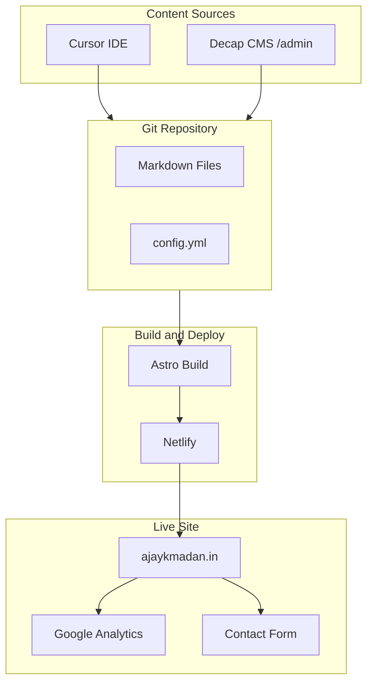

# WordPress to Static Site Migration Plan

**Project:** ajaykmadan.in  
**Target:** Astro static site + Decap CMS + Netlify  
**Project Location:** `/Users/ajaymadan/Documents/GitHub/Ajay-Professional-Website`

---

## Architecture Overview



---

## Phase 1: Prerequisites and Content Export

### Step 1.1: Export content from WordPress

1. Log into WordPress admin at your site (typically `ajaykmadan.in/wp-admin`)
2. Go to **Tools > Export**
3. Select **All content** (or export Posts and Pages separately)
4. Download the XML file (e.g. `ajaykmadan-wordpress-export.xml`)
5. Save it in the project folder: `export/`

### Step 1.2: Export and download media

1. Use **Tools > Export** for media, or use a plugin like **All-in-One WP Migration** / **WP All Export** if needed
2. Alternatively: manually download images from the Media Library
3. Note current image URLs for mapping during migration

### Step 1.3: Record current site structure

Document from the live site:

- **Pages:** Home, Projects (Key Projects, Workflow, Commercials), Blog, About, Contact
- **Navigation:** Home, Projects (submenu), Blog, About, Contact (Consultation, Write to me), Schedule a Free Consultation
- **Key content:** Hero copy, testimonial (Chris Sigala), logo, tagline "Adapt. Evolve. Grow."

---

## Phase 2: Astro Project Setup

### Step 2.0: Create project directory (if needed)

```bash
mkdir -p /Users/ajaymadan/Documents/GitHub/Ajay-Professional-Website
cd /Users/ajaymadan/Documents/GitHub/Ajay-Professional-Website
```

### Step 2.1: Create Astro project

```bash
cd /Users/ajaymadan/Documents/GitHub/Ajay-Professional-Website
npm create astro@latest . -- --template minimal --install --no-git
```

### Step 2.2: Project structure

```
Ajay-Professional-Website/
├── public/
│   ├── admin/              # Decap CMS
│   │   ├── index.html
│   │   └── config.yml
│   └── images/             # Static assets, logo
├── src/
│   ├── content/
│   │   ├── blog/           # Blog posts (Markdown)
│   │   ├── projects/       # Key Projects, Workflow, Commercials
│   │   └── config.ts       # Content collection schemas
│   ├── components/
│   ├── layouts/
│   └── pages/
├── export/                 # WordPress XML goes here
├── astro.config.mjs
└── package.json
```

### Step 2.3: Content collections

Define schemas in `src/content/config.ts` for:

- **blog:** title, date, description, body (markdown), thumbnail
- **projects:** title, slug, order, body (markdown)

---

## Phase 3: Convert WordPress Content to Markdown

### Step 3.1: Install conversion tool

```bash
cd /Users/ajaymadan/Documents/GitHub/Ajay-Professional-Website
npx wordpress-export-to-markdown
```

Or:

```bash
npm install -g wordpress-export-to-markdown
wordpress-export-to-markdown "export/ajaykmadan-wordpress-export.xml"
```

When prompted, specify output folder as `src/content/blog/` for posts.

### Step 3.2: Configure output for Astro

- Output folder: `src/content/blog/` for posts
- Ensure frontmatter includes: `title`, `pubDate` or `date`, `description`
- Images: save to `public/images/` and update paths in Markdown

### Step 3.3: Manual content for pages

Create Markdown or Astro pages for:

- **Key Projects, Workflow, Commercials** – copy from live site or create placeholder content
- **About** – migrate from WordPress About page
- **Testimonial** – store in `src/data/testimonials.json`

---

## Phase 4: Decap CMS Integration

### Step 4.1: Add admin route

Create `public/admin/index.html` with Decap CMS script and config link.

### Step 4.2: Create config.yml

Create `public/admin/config.yml` with:

- **Backend:** `git-gateway` (Netlify) or `github` with repo/branch
- **Media folder:** `public/images/uploads`
- **Collections:** blog, projects

### Step 4.3: Enable Netlify Git Gateway

After deploying to Netlify:

1. Netlify Dashboard > Identity > Enable Identity
2. Identity > Services > Enable Git Gateway
3. Add yourself as a user (invite or sign up)

---

## Phase 5: Recreate Layout and Pages

### Step 5.1: Base layout and components

- **BaseLayout.astro:** HTML shell, meta tags, analytics script placeholder
- **Header.astro:** Logo, "Adapt. Evolve. Grow.", nav
- **Footer.astro:** Credits (Images: adobe.express.com, Icons: icons8.com)

### Step 5.2: Homepage

- Hero: "Technology Leadership" headline, 3 supporting paragraphs
- CTA button: "Schedule A Free Consultation"
- Testimonial block: Chris Sigala quote and attribution

### Step 5.3: Projects pages

- `/projects/` – index listing Key Projects, Workflow, Commercials
- Individual pages for each project type

### Step 5.4: Blog, About, Contact

- Blog: list and single post pages using content collections
- About: static page
- Contact: page with ContactForm component

---

## Phase 6: Contact Form

### Step 6.1: Choose provider

**Formspree** (recommended): Free tier 50 submissions/month.

### Step 6.2: Implementation

1. Sign up at [formspree.io](https://formspree.io)
2. Create a form, get endpoint (e.g. `https://formspree.io/f/xxxxx`)
3. Add `PUBLIC_FORMSPREE_ENDPOINT` to `.env` (the ID part after `/f/`)

### Step 6.3: Consultation CTA

- "Schedule A Free Consultation" links to `/contact/?type=consultation`
- Contact form includes hidden field for consultation vs general inquiry

---

## Phase 7: Google Analytics (GA4)

### Step 7.1: Create GA4 property

1. [Google Analytics](https://analytics.google.com) > Admin > Create Property
2. Get Measurement ID (e.g. `G-XXXXXXXXXX`)

### Step 7.2: Add to Astro

Add `PUBLIC_GA_MEASUREMENT_ID` to `.env` and Netlify env vars. BaseLayout.astro already includes the GA script when this is set.

---

## Phase 8: SEO and Redirects

### Step 8.1: Preserve URLs

Map old WordPress URLs to new static URLs. Add 301 redirects for any changed paths.

### Step 8.2: Netlify redirects

Create `public/_redirects` or configure in `netlify.toml`.

### Step 8.3: Meta and sitemap

- Add `description`, `og:image` in BaseLayout.astro
- `@astrojs/sitemap` generates sitemap automatically

---

## Phase 9: Deployment to Netlify

### Step 9.1: Push to GitHub

```bash
cd /Users/ajaymadan/Documents/GitHub/Ajay-Professional-Website
git init
git add .
git commit -m "Initial Astro site"
git remote add origin https://github.com/YOUR_USERNAME/ajay-professional-website.git
git push -u origin main
```

### Step 9.2: Connect Netlify

1. Netlify > Add new site > Import from Git
2. Select the repo
3. Build command: `npm run build`
4. Publish directory: `dist`
5. Add env vars: `PUBLIC_GA_MEASUREMENT_ID`, `PUBLIC_FORMSPREE_ENDPOINT`

### Step 9.3: Enable Identity and Git Gateway

1. Site > Identity > Enable Identity
2. Identity > Services > Enable Git Gateway
3. Invite yourself for Decap CMS access

### Step 9.4: Custom domain

1. Netlify > Domain settings > Add custom domain
2. Add `ajaykmadan.in`
3. Update DNS at your registrar

---

## Phase 10: Cutover and Validation

### Step 10.1: Pre-launch checklist

- All pages load correctly
- Navigation works (including submenus)
- Contact form submits and you receive test email
- Google Analytics receives page views
- Decap CMS `/admin` loads and you can edit content
- Mobile responsive
- Old URLs redirect correctly

### Step 10.2: DNS cutover

1. Update DNS to point `ajaykmadan.in` to Netlify
2. SSL auto-provisions via Let's Encrypt
3. Keep WordPress hosting active briefly for rollback if needed

### Step 10.3: Post-launch

- Monitor GA for traffic
- Check Search Console for indexing
- Cancel WordPress hosting after a stable period

---

## File Summary

| File | Purpose |
|------|---------|
| `public/admin/index.html` | Decap CMS entry |
| `public/admin/config.yml` | Decap collections, backend, media |
| `src/content/config.ts` | Astro content collection schemas |
| `src/layouts/BaseLayout.astro` | Layout, GA script |
| `src/components/ContactForm.astro` | Formspree contact form |
| `netlify.toml` or `_redirects` | Redirects, build config |
| `.env.example` | Document env vars (no secrets) |

---

## Execution Order

Execute phases in sequence. Phase 1 (export) can be done immediately. Phases 2–5 build the site; 6–7 add Contact and GA; 8–10 handle deploy and cutover.
